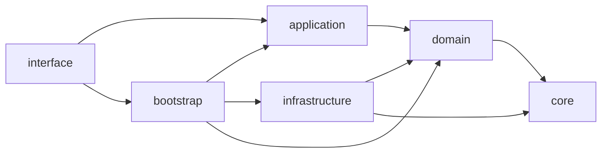
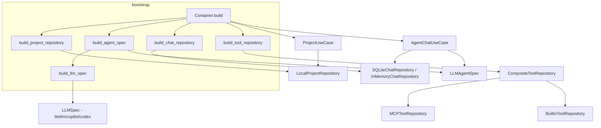
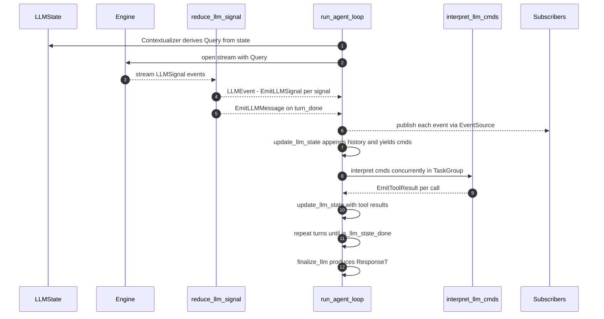
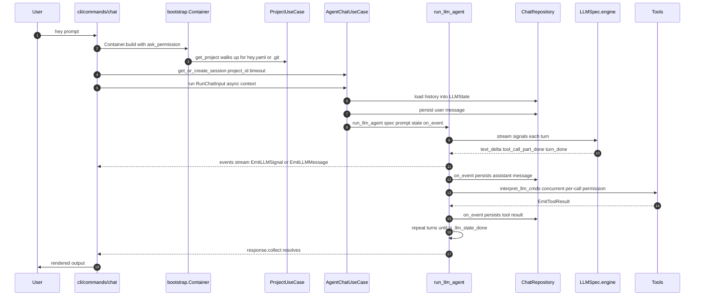

# Architecture

`hey` is a CLI chat agent. It is structured around a **clean / layered architecture** with explicit dependency rules, plus a small **engine core** (agent runtime, workflow graph, MCP, schema) that the application layer reuses. This document describes the runtime layout, key abstractions, and how a single `hey "<prompt>"` invocation actually flows through the system.

## Layers

```
src/hey/
├── interface/         # CLI: argparse, terminal rendering (rich)
│   └── cli/
├── application/       # Use cases + DTOs (TypedDict)
│   ├── usecases/
│   └── dto.py
├── bootstrap/         # Composition root (Container, factories)
├── domain/            # Pure domain (no I/O)
│   ├── entities/
│   ├── repositories/  # Protocols only
│   └── services/      # Domain logic, agent/llm/workflow orchestration
├── core/              # Reusable engine pieces (no domain knowledge)
│   ├── agent/         # Generic agent runtime (Engine/Reducer/Contextualizer)
│   ├── workflow/      # WorkflowExecutor, WorkflowGraph, EventSource
│   ├── mcp/           # MCP client + transports
│   ├── schema/        # JSON schema / Python signature inspection
│   ├── pattern/       # JSON pattern matching (used for permissions)
│   └── markdown/      # Markdown parser/reducer
└── infrastructure/    # Concrete adapters (I/O, side effects)
    ├── llm/           # litellm / copilot / codex / bedrock backends
    ├── repositories/  # SQLite/in-memory chat, project, tool repos
    ├── tool/          # Built-in tool implementations
    ├── chat/  project/
```

### Dependency rule

Allowed imports (one direction only):



- `domain` and `application` MUST NOT import from `infrastructure` or `interface`.
- `core/` is generic engine code and only depends on the standard library / pydantic. It knows nothing about chat sessions, projects, or LLM-specific shapes.
- Concrete LLM backends and tool implementations live in `infrastructure/`. They are wired in only via `bootstrap/factories.py`.

## Composition root: `bootstrap.Container`

`hey.bootstrap.Container.build(...)` (`src/hey/bootstrap/container.py`) is the only place where concrete infrastructure is instantiated and handed to use cases. The CLI commands always go through it; new dependencies should be wired here, not built ad-hoc.



### Backend routing

`build_llm_spec` selects an `LLMSpec` by **model prefix** (`bootstrap/constants.py`):

| Prefix              | Backend module                          | Required extra |
|---------------------|------------------------------------------|----------------|
| `github-copilot/…`  | `infrastructure.llm.copilot`            | `copilot`      |
| `codex/…`           | `infrastructure.llm.codex`              | `codex`        |
| `opencode-go/…`     | `infrastructure.llm.opencode`           | `opencode`     |
| `opencode/…`        | `infrastructure.llm.opencode`           | `opencode`     |
| (anything else)     | `infrastructure.llm.litellm` (default)  | `litellm`      |

Note: `opencode-go/…` routes to `https://opencode.ai/zen/go/v1/chat/completions`; `opencode/…` routes to `https://opencode.ai/zen/v1/chat/completions`. Both require the `OPENCODE_API_KEY` environment variable.

Backend imports are deferred to call time so missing extras only fail when you actually try to use that backend.

`build_llm_spec` also calls `build_agents_instructions(project_directory)` (`domain/services/agentsmd.py`) to load `AGENTS.md` files and prepend them to the system prompt. Discovery order: nearest `AGENTS.md` walking up from the project root, then `~/.config/hey/AGENTS.md`. The two sources are concatenated; the result is merged with `ChatConfig.instructions`.

### Tool registry

Tools come from a `CompositeToolRepository` that merges:

- `BuiltinToolRepository` — built-in tools (`bash`, `edit`, `glob`, `grep`, `ls`, `read`, `web_fetch`, `web_search`, `search_chat_messages`). Each builtin module exposes `is_available()` + `create_tool_spec(...)`; unavailable tools are silently skipped.
- `MCPToolRepository` — tools fetched from MCP servers declared in `hey.yaml`. Names are namespaced as `mcp_<server>_<tool>`.

Later repositories override earlier ones on name collision.

## Project & runtime data

A "project" is auto-discovered by walking up from `cwd` looking for `hey.yaml` or `.git` (`domain/services/project.py:get_project_directory`). Tests/scripts run from the repo root resolve this repo as the project.

```
<project>/
├── hey.yaml          # ChatConfig (model, instructions, permissions, mcp servers)
└── .hey/
    └── hey.db        # SQLite chat history (per project)
```

`Project.id = ProjectID(absolute_path)` — projects are keyed by absolute filesystem path.

## Domain entities (key types)

All defined under `domain/entities/`:

- `LLMMessage = SystemMessage | UserMessage | AssistantMessage | ToolResultMessage` — discriminated `TypedDict` union (pydantic Discriminator on `role`).
- `LLMSignal` — fine-grained streaming events from the LLM (`text_delta`, `tool_call_args_delta`, `thinking_delta`, `turn_done`, …).
- `LLMState` — frozen dataclass: `(history, tools, finalizer)`.
- `LLMEvent = EmitLLMSignal | EmitLLMMessage | EmitToolResult` — what the agent loop emits.
- `LLMCmd = RunToolCall` — what the agent loop asks the runtime to execute.
- `LLMSpec` — pairs a streaming `Engine[Query, LLMSignal]` with a `Contextualizer[Query, LLMState]` (state→query adapter).
- `LLMAgentSpec` — `LLMSpec` + tools + permissions + response format.
- `ToolSpec` — Python callable + permission map + parameter/return annotations (pydantic-derivable JSON schema). Permissions are `{ParamPattern: "allow" | "deny" | "ask"}`, evaluated last-match-wins via `core.pattern.json_match` against `args_json`.

## Agent runtime (`core/agent` + `domain/services/llm.py`)

The agent loop is built from three small protocols (`core/agent/protocols.py`):

- `Engine[Query, Signal]` — async context manager yielding low-level signals.
- `Reducer[Buffer, Signal, Event]` — folds signals into higher-level events.
- `Contextualizer[Query, State]` — derives the next `Query` from the current `State`.

`run_agent_loop` (`core/agent/runtime.py`) ties them together with four user-supplied callables: `update`, `interpret`, `is_done`, `finish`. It is fully generic and has no notion of "LLM" or "tool".

The LLM specialization lives in `domain/services/llm.py`:

- `reduce_llm_signal` — buffers signals per turn; on `turn_done` emits a single `EmitLLMMessage(AssistantMessage(...))` synthesized from the buffered text/tool-call parts.
- `update_llm_state` — appends emitted messages to `state.history`; for assistant tool calls, dispatches `RunToolCall` cmds (or emits an error tool-result if the tool name is unknown).
- `interpret_llm_cmds` — runs all tool calls of a turn concurrently in a `TaskGroup`. Per call: resolve permission via pattern match → optionally `ask_permission` → run `tool_spec.func(**params)` → JSON-encode result, truncate to 50 KiB, emit `EmitToolResult`. Tool failures and denials become tool-result text rather than crashing the loop.
- `is_llm_state_done` — finished when no `finalizer` and the last message is `assistant`, OR a finalizer tool was called.
- `finalize_llm` — extracts the final text or decodes the structured tool result of the finalizer call.

Per-turn flow:



### `WorkflowResponse` (event delivery)

`run_agent_loop` returns a `WorkflowResponse[Event, State, Result]` (`core/workflow/response.py`). It bundles:

- An `EventSource[Event]` (multi-subscriber, bounded buffer; `DROP` policy on slow consumers by default).
- A coroutine producing the final `(state, result)`.

Callers can independently:

- `async for event in resp.events()` — subscribe to the live event stream (multiple subscribers OK).
- `await resp.collect()` — await the final `(state, result)`.

The CLI uses both: it iterates `events()` for streaming UI updates, then `await response.collect()` to wait for completion (see `interface/cli/commands/chat.py`).

`WorkflowResponse.events()` lazily starts the producing task on first subscribe, so creating a response is cheap and side-effect-free until something subscribes or collects.

## Workflow graph (`core/workflow`, `domain/services/workflow.py`)

A separate, larger orchestration primitive used to compose **multiple agent runs** as a DAG. Not used by the basic `hey "<prompt>"` chat path — that goes straight through `run_llm_agent` — but available for richer flows.

- `WorkflowGraph[State, Event, Terminal]` — list of `WorkflowNode`s with `deps`, optional `cond`/`until` predicates.
- `WorkflowExecutor` — validates the DAG (no cycles, no unknown deps), runs ready batches in parallel via `asyncio.TaskGroup`, applies `BaseWorkflowHandler.update` between batches, emits lifecycle events (`WorkflowStartedEvent`, `WorkflowNodeStartedEvent`, …), and supports early termination via `Stop`.
- `domain.services.workflow` provides helpers to wrap an `LLMAgentSpec` (or a plain async callable) as a `WorkflowNode`, threading `LLMWorkflowState` through the graph.

## Chat use case (`AgentChatUseCase`)

`application/usecases/chat.py` exposes session lifecycle and the streaming `run` context manager:

- `create_session` / `get_or_create_session` (with `session_timeout` from `ChatConfig`) / `resume_session` / `get_messages_by_*`.
- `run(RunChatInput)` is an `@asynccontextmanager` yielding a `WorkflowResponse[LLMEvent, LLMState, ResponseT]`. It:
  1. Loads prior `LLMState` from the chat repository for the session.
  2. Persists the new user message immediately.
  3. Calls `run_llm_agent(spec, prompt, state, on_event=...)`.
  4. The `on_event` callback (`make_on_event_callback_for_chat`) persists every assistant message and tool result into the repository as it is emitted.

The repository is reused as a **transaction boundary** via its context manager (`with self._chat_repository: ...`) for session creation. SQLite repository uses one connection in WAL mode with explicit `BEGIN/COMMIT/ROLLBACK` driven by `__enter__`/`__exit__`.

## CLI flow

Entry: `hey = hey.__main__:run` → `hey.interface.cli.main` (`src/hey/interface/cli/app.py`). Subcommands live in `src/hey/interface/cli/commands/` (`chat.py`, `history.py`).

> Note: `src/hey/cli/` exists but is empty (only `__pycache__`). The real CLI is under `src/hey/interface/cli/`. Don't add code to `src/hey/cli/`.

End-to-end, a single `hey "what is X?"` invocation looks like:



The CLI also reads `stdin` when not a TTY and appends it to the prompt (`chat.py:_run_chat`), so piping `cat file | hey "summarize"` works.

## Permissions

Two complementary layers:

1. **Per-tool permission map** on `ToolSpec.permission` — `{ParamPattern → action}`. Patterns are matched against the tool's `args_json` using `core.pattern.json_match`. Last matching pattern wins; default is `allow`.
2. **Project-level permission overrides** in `hey.yaml` (`ChatConfig.permission: {ToolName → ParamPattern → action}`), merged into specs by `setup_tool_permission` (`domain/services/tool.py`).

If the resolved action is `ask`, the use case calls the `ask_permission` callback wired via `Container.build(ask_permission=...)`. The CLI implementation prompts interactively via `interface/cli/display/chat.py:ask_permission`, serialized through an `asyncio.Lock` to avoid overlapping prompts when multiple tool calls in one turn need approval.

## Optional dependencies

Optional extras gate entire backends/toolsets (`pyproject.toml`):

| Extra      | Enables                                                                |
|------------|------------------------------------------------------------------------|
| `litellm`  | Default LLM backend (`infrastructure.llm.litellm`).                    |
| `copilot`  | GitHub Copilot backend (`github-copilot/...` model prefix).            |
| `codex`    | Codex backend (`codex/...` model prefix).                              |
| `opencode` | OpenCode backend (`opencode/...` and `opencode-go/...` model prefixes). |
| `bedrock`  | AWS Bedrock support (via litellm + boto3).                             |
| `web`      | `web_fetch` (markitdown) and `web_search` (ddgs) built-in tools.       |

Imports of these packages MUST stay lazy (deferred to the factory or `is_available()` check). The matching `is_available()` in each builtin tool module is what decides whether the tool is registered at all.

## Tests

- Real tests live only under `tests/unit/`; `tests/integration/` is a stub (`__init__.py` only).
- `pytest-asyncio` runs in `auto` mode (declare `async def test_...`, no `@pytest.mark.asyncio`).
- `tests/unit/conftest.py` provides factories for messages and tool specs (`make_user_message`, `make_assistant_message`, `make_tool_call_record`, `make_tool_spec`). Prefer these over hand-constructing entities — they keep tests resilient to entity-shape changes.

## Adding things — quick map

| Want to add…                  | Touch                                                                                       |
|-------------------------------|---------------------------------------------------------------------------------------------|
| New CLI subcommand            | `interface/cli/commands/<name>.py`, register in `interface/cli/app.py`.                     |
| New built-in tool             | `infrastructure/tool/builtins/<name>.py` (`is_available`, `create_tool_spec`); add to `_BUILTIN_TOOL_ENTRIES` in `infrastructure/repositories/tool/builtin.py`. |
| New LLM backend               | `infrastructure/llm/<backend>.py` exposing `get_<backend>_spec(...)`; route via prefix in `bootstrap/factories.build_llm_spec`; add an optional extra in `pyproject.toml`. |
| New repository implementation | Protocol in `domain/repositories/<x>.py`; impl in `infrastructure/repositories/<x>/`; wire in `bootstrap/factories.py`. |
| New use case                  | `application/usecases/<name>.py` + DTOs in `application/dto.py`; expose via `Container`.     |
| New entity                    | `domain/entities/<name>.py`, kept I/O-free.                                                  |
